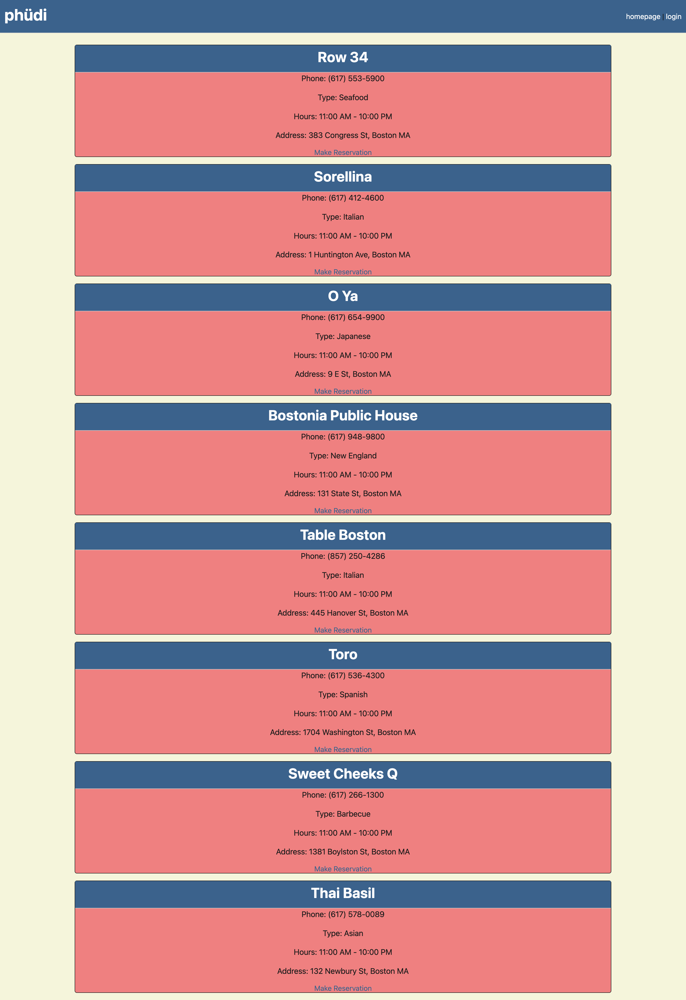

# phudi

## Description

The purpose of this project is to allow users who are hungry, to see nearby restaurants and make a reservation without having to pick up the phone. This application utilizes mysql and sequelize to store and interact with the necessary data. This data includes resturants, users, and reservations. In order for the user's information to be secure, bcrypt is used so that the passwords are hashed and a hacker cannot log into their account if emails and passwords are exposed. This project also uses nodemailer so that when a user creates a new reservation, a confirmation is sent to their email as proof. Lastly, this application uses handlebars since the pages rendered are similar in structure but have different information per restaurant, user, and reservation.

## Table of Contents
- [Installation](#installation)
- [Usage](#usage)
- [Credits](#credits)
- [License](#license)

## Installation

In order to use this application, install the following:
1. npm i 

This will install the following:
- bcrypt@5.1.0,
- connect-session-sequelize@7.1.5,
- dotenv@16.0.3,
- express@4.18.2,
- express-handlebars@7.0.6,
- express-session@1.17.3,
- mailgen@2.0.27,
- mysql2@3.2.1,
- nodemailer@6.9.1,
- sequelize@6.31.0

## Usage

Use this application when you want to make a reservation at a restaurant nearby. Click this link to use the application: https://phudireservations.herokuapp.com/

## Credits

- Brian Ebel: https://github.com/bcebel
- Chris Cota: https://github.com/ChrisJCota
- Joey Deshaies: https://github.com/jdeshaies

## License

